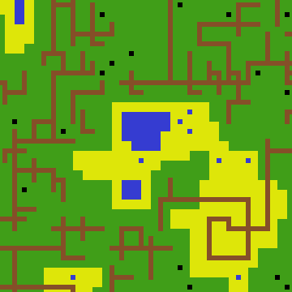

# Collapse generative algorithms

Given sample gridmaps, these algorithms can analyze the underlying tile adjacency rules and
generate completely new, random maps in servicable speed.

Examples presented there are generated using `vis` feature, which allows reading and writing 2D gridmaps from image files, and are based on two sample gridmaps containing tiles in size of 4x4 pixels, with 100 and 400 individual tiles, below resized for better clarity: 

## Queues

Collapsible algorithms needs to have some order in which to collapse tiles. Two different types of *queues* are provided in `grid_forge`:

- `PositionQueue` - simple queue, moving on predetermined path (rowwise left-to-right by default). It allows for faster generation speeds, but can be more error-prone, as it doesn't take into account number of possible options for given tile to be able to collapse to.
- `EntrophyQueue` - more advanced queue, taking into account the possible options and their weight. It chooses the cells by their *entrophy*, choosing the one with lowest measure for the next collapse. As it needs to propagate changes, it is a little slower but have much higher success rate, particularly when generating grids with some tiles already collapsed.

The decision about which *queue* to use depends on the complexity of the tiles and their
rulesets, time and intended output.

## Single tiled algorithms

Structs kept in `gen::collapse::singular` module can be used to create maps based on adjacency rules on single tile basis, which can be described as:

> For the given tile X, in direction D tiles A, B, C .. n can be placed. 

`IdentityAnalyzer` creates `AdjacencyRules` that are precisely that. They can be more restrictive, as the tiles will be placed near themselves only if it have been so in the source image, even if *logically* they should be possible to be neighbours.

Below example 30x30 map generated with help of `EntrophyQueue`:

`BorderAnalyzer` creates more liberate rules - it checks tiles for posible adjacent in sample map similarly to previous analyzer, but additionally creates new rules based on the tile borders. To describe it more naturally:

> If given tile X is adjacent to both tile A and tile B in direction D, they share the same border. If tile C is adjacent to tile X in direction opposite to D, tiles A and B can be placed adjacent to C in direction D.

Below example of 30x30 map generated with the help of default `PositionQueue`:

## Overlapping algorithm

Structs kept in `gen::collapse::overlapping` module can be used to create maps based on 
overlapping patterns of tiles. Given some sample gridmaps `overlapping::Analyzer` creates
a `PatternCollection` containing `WIDTH x HEIGHT` tiles, which afterwards the
`overlapping::Resolver` will try to place on newly generated grid.

